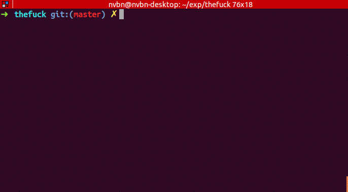
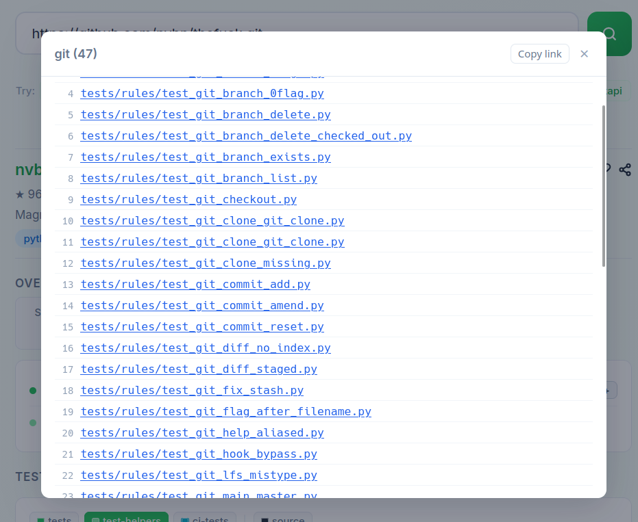
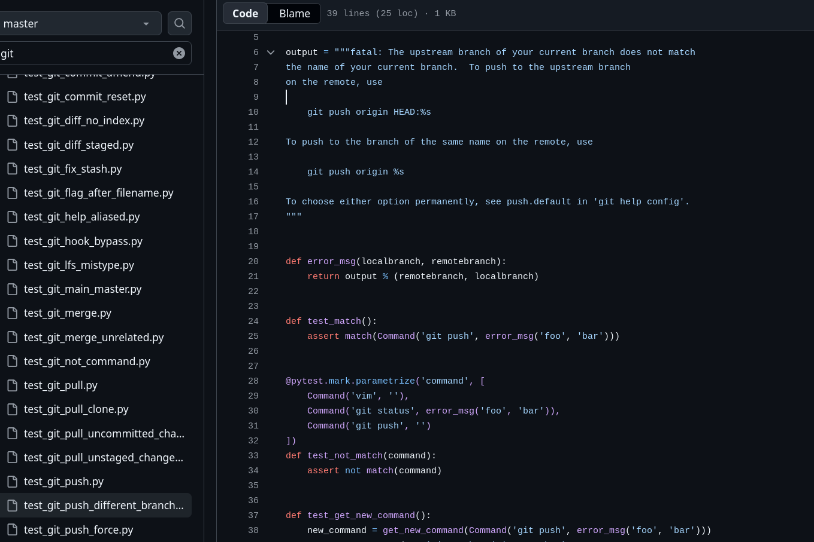

# Explorando Práticas de Teste

Neste exercício, vamos explorar práticas de teste em sistemas reais utilizando a ferramenta [TestMiner](https://andrehora.github.io/testminer).

O TestMiner permite visualizar e analisar testes de software em repositórios do GitHub, fornecendo dados sobre como os projetos organizam seus testes, como eles evoluem entre versões e quais bibliotecas de teste são utilizadas.
Explore a ferramenta antes de começar para se familiarizar com seu funcionamento.

---

## Passo 1: Selecionar um repositório

Escolha um repositório real que possua testes escritos na linguagem de sua preferência.
Abaixo estão alguns links para ajudá-lo a encontrar projetos interessantes:

- **Python:** https://github.com/topics/python?l=python
- **JavaScript:** https://github.com/topics/javascript?l=javascript
- **TypeScript:** https://github.com/topics/typescript?l=typescript
- **Java:** https://github.com/topics/java?l=java

## Passo 2: Explorar o repositório selecionado

Busque o repositório escolhido no [TestMiner](https://andrehora.github.io/testminer) e analise os dados de teste gerados pela ferramenta.

## Passo 3: Explicar uma prática de teste

Com base nos dados obtidos, selecione uma prática ou dado de teste relevante e explique-o com suas próprias palavras.

---

## Instruções de entrega

1. Faça um `fork` deste repositório (saiba mais sobre forks [aqui](https://docs.github.com/pt/pull-requests/collaborating-with-pull-requests/working-with-forks/fork-a-repo)).
2. Responda às questões abaixo diretamente neste arquivo `README.md` do seu fork. Pode adicionar imagens para enriquecer sua explicação.
3. No Moodle, submeta apenas a URL do seu fork.

---

## Respostas

**1. Repositório selecionado:** https://github.com/nvbn/thefuck.git

**2. Explicação:** 
    A ferramenta "thefuck" conserta comandos errados digitados no terminal, quando o usuário digita "fuck" logo em seguida de um erro:

Ao observar as estatísticas de testes no TestMiner, foi possível observar que, grande parte dos arquivos de testes do repositório serviam para testar exclusivamente correções de comandos do sistema de controle de versão Git:

Esse foco no git ocorre, porque, além de ser um sistema muito usado, seus comandos possuem especificidades que podem ser frustrantes para muitos desenvolvedores. Como as mensagens de erro do git são bem detalhadas (com explicações sobre Missing Upstream, divergências de branch, nomes trocados ou sugestões), o thefuck aproveitou para garantir que a maior parte dos comandos git fosse automaticamente corrigida e extremamente bem testada, uma vez que a maior parte dos usuários estaria instalando a ferramenta justamente pra corrigir seus comandos git:

Além disso, foi possível observar que, grande parte de seus testes são feitos com a união do framework pytest, e com o uso de mocks.
